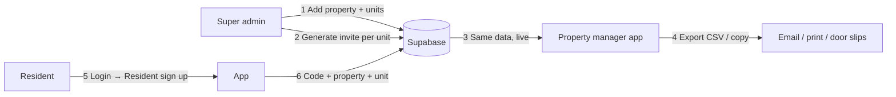

# Resident invite codes — operational playbook

## Short answer

**Codes are not emailed or “pushed” to the PM.** They live in **Supabase** (`invite_codes` + `units`). As soon as super admin saves a code for a unit, any **property manager assigned to that property** sees it on the **Properties → Units & Invite Codes** tab (after refresh). PMs can **export CSV** to print, email, or drop slips at each door.

---

## End-to-end flow

| Step | Who | Where in app | What happens |
|------|-----|--------------|--------------|
| 1 | Super admin | **Properties → Add Property** (optional starter unit) or add buildings/floors/units in DB | Unit numbers exist (e.g. 101, 102, 104) |
| 2 | Super admin | **Tools → Resident Invite Codes** | Pick property + unit → **Generate** → random 8-char code saved to `invite_codes` |
| 3 | System | — | Code is tied to `property_id` + `unit_id` — **no separate send step** |
| 4 | Property manager | **Properties tab** | Sees every unit: vacant/occupied, code or “no code yet” |
| 5 | Property manager | **Export unit codes (CSV)** on Properties tab | Spreadsheet: property, unit, code, status, signup instructions |
| 6 | Resident | Login → **Resident** | Property + **unit number** + **invite code** + name/email/password |

---

## What you do NOT need to do

- **Do not** paste AI-generated codes into the PM dashboard manually — the app does not support PM-side code entry today.
- **Do not** expect codes to auto-email the PM — use export or have super admin share the admin screen list.
- **Do not** use **Staff** signup for residents — that flow is for PM / ops manager / driver only.

---

## Recommended onboarding for a new complex

1. **Collect unit list** from the apartment (spreadsheet: unit numbers only is enough).
2. **Super admin**
   - Create property (address, service window).
   - Add all units (today: one-by-one via Add Property starter unit + more units in DB, or repeat; bulk import is a future enhancement).
   - **Resident Invite Codes**: generate one code per unit (app generates random codes — you do not need AI for codes unless you want a custom pattern later).
3. **Assign property manager** (Manager Assignments or staff invite as PM).
4. **Property manager** signs in → **Properties** → confirm all units show codes → **Export CSV**.
5. **Distribute to residents** (pick one):
   - Email CSV column per unit
   - Print door hangers with: unit #, code, link `http://localhost:8091` (or production URL), steps: “Tap Resident → enter property name, unit, code”
6. **Resident** completes signup; PM dashboard will show **Used** on that unit.

---

## How codes are generated (technical)

- Table: `public.invite_codes`
- Columns: `code`, `property_id`, `unit_id`, `max_uses`, `use_count`, `expires_at`, `is_active`
- Super admin UI: `AdminInviteCodesScreen` — secure random A–Z / 2–9 (8 chars), e.g. `WELCOME104` style in seed data is manual; live generation is random.
- Verification: RPC `verify_invite_code(code, property_id, unit_number)` on resident signup.

---

## Property manager visibility rules

PM sees a property when:

- `user_properties` links their user to that `property_id`, **or**
- `properties.company_id` = their user id (set when they sign up via PM staff invite).

They see codes only for units under that property’s buildings/floors/units tree.

---

## Future improvements (backlog)

- [ ] Bulk unit import (CSV upload: unit_number list)
- [ ] Bulk invite generate (“generate codes for all units without a code”)
- [ ] Optional custom code prefix (e.g. `RIVERSIDE-101`) instead of random only
- [ ] PM email when super admin generates codes (notification)
- [ ] Printable PDF door slip template from export

---

## Quick test (Sunset Gardens seed)

| Field | Value |
|-------|--------|
| Property | Sunset Gardens |
| Unit | 104 |
| Code | WELCOME104 |

Resident sign up → select property → unit `104` → code `WELCOME104`.
